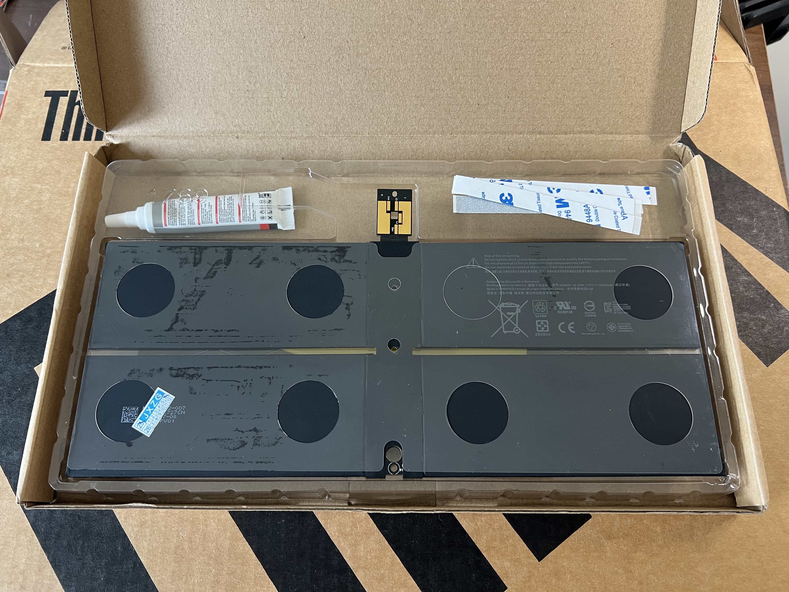

## 🔋 Battery Replacement: Giving Lazarus New Life

To bring the Surface Laptop 2 back from the dead, the aging battery had to go. This upgrade was both affordable and symbolic — a literal power-up for Project Lazarus.

### 🧾 Cost Breakdown

- **¥118 CNY** (~$16 USD) — Replacement battery ordered from **Taobao**, China’s biggest e-commerce platform.
- 
- **¥500 CNY** (~$69 USD) — Professional installation by a local technician.
- 
> ⚠️ Official Microsoft repair services typically charge **$200–$300 USD** or more for Surface battery replacements — often requiring the entire top case to be replaced. That wasn’t an option here.

### 🔧 The Repair

Surface devices are notoriously difficult to open due to adhesive-sealed screens. Rather than risk breaking the display or damaging internals, the repair was handed off to a **local technician** found through a niche WeChat repair group — the kind of shop hidden in an electronics alley, not listed on any map, but trusted by word of mouth.

Armed with a heat gun, suction cups, and experience, the tech completed the swap in under an hour. No cracks. No errors. Just precision.

### ⚙️ Result

- Battery health reports 100%
- Charges and discharges as expected
- Fully functional under Arch Linux

> Lazarus now runs completely untethered — a proper mobile Linux workstation.

